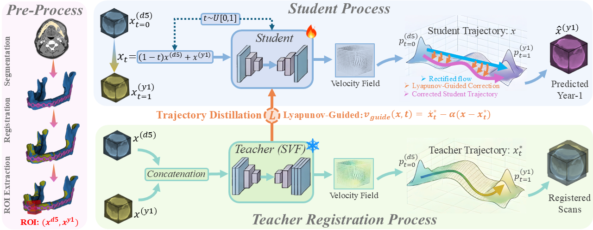

# OsteoFlow: Lyapunov-Guided Flow Distillation for Predicting Bone Remodeling after Mandibular Reconstruction

OsteoFlow is a teacher–student framework for predicting Year-1 post-operative CT from Day-5 CT after mandibular reconstruction. It combines diffeomorphic registration and rectified flow modeling to learn bone remodeling at the graft–host interface. During training, a registration-based teacher provides trajectory supervision, while the student learns an image-space transport field with Lyapunov regularization. At inference time, only the student model is used.

## Table of Contents

- [Method Overview](#method-overview)
- [Installation](#installation)
- [Usage](#usage)
- [Repository Structure](#repository-structure)
- [Configurable Parameters](#configurable-parameters)
- [Baseline Implementation Details](#baseline-implementation-details)
- [Data and Checkpoints](#data-and-checkpoints)
- [Reproducibility Notes](#reproducibility-notes)
- [Citation](#citation)

## Method Overview

The framework has two stages:

- **Teacher:** diffeomorphic registration with stationary velocity fields (SVF) to generate supervision trajectories
- **Student:** rectified flow trained with teacher guidance and Lyapunov regularization

Only the student is needed at test time.

### Framework


Overview of the preprocessing pipeline and teacher–student distillation framework used to guide the student velocity field.

### Qualitative Results


Representative predictions for union, partial union, and nonunion cases, shown on the resection plane and orthogonal central slices.

## Installation

```bash
pip install -r requirements.txt
```

## Usage

Run the teacher model:

```bash
python Code/OsteoFlow_Teacher_V0.py
```

Run the student model:

```bash
python Code/OsteoFlow_Student_V0.py
```

## Repository Structure

```text
OsteoFlow/
├── README.md
├── requirements.txt
├── Code/
│   ├── OsteoFlow_Teacher_V0.py
│   └── OsteoFlow_Student_V0.py
└── assets/
    ├── method.png
    └── results.png
```

## Configurable Parameters

Some parameters and flags can be changed in the code.

In particular, `LOSS_MODE` controls the training setup:

- `fm_only` — rectified flow only
- `lqr_only` — Lyapunov-guided teacher only
- `both` — joint training

```python
# The parameters and flags in this code can be adjusted depending on the training setup.
# LOSS_MODE controls which supervision is used:
#   'fm_only'  -> rectified flow only
#   'lqr_only' -> Lyapunov-guided teacher only
#   'both'     -> joint training
LOSS_MODE = 'both'  # 'both' | 'lqr_only' | 'fm_only'
```

## Baseline Implementation Details

- MedVAE: We fine-tuned the released checkpoint from [MedVAE](https://github.com/StanfordMIMI/MedVAE) using `medvae_4x_1c_3d_finetuning` for CT modality in two versions: v1 used the MedVAE-recommended loss setup (LPIPS + PatchGAN), and v2 used our resection-aware loss (Eq. 5 in our paper).
- cDDPM($\Delta$): We used a [MONAI](https://project-monai.github.io/)-based conditional DDPM that is conditioned on POD5, trained to predict the difference target $\Delta=\mathrm{POY1}-\mathrm{POD5}$, and sampled with DDIM inference to reconstruct the final POY1 CT.
- Pix2Pix-3D: We followed [pix2pix](https://github.com/phillipi/pix2pix) and adapted it to 3D ROI translation (POD5$\rightarrow$POY1) with a 3D ResUNet generator and 3D PatchGAN discriminator, trained with adversarial BCE losses and an $L_1$ reconstruction term.
- GRIT-3D (adapted): Since official code was not publicly available, we followed the GRIT paper/project page ([cs.umd.edu/~sakshams/grit](https://www.cs.umd.edu/~sakshams/grit/)) and implemented a 3D adaptation; this is not a strict reproduction of original GRIT, because our version uses a reconstruction-plus-residual decomposition for GAN training but does not include the original style encoder pathway.
- SegGuidedDiff-3D (adapted): We followed [Segmentation-Guided Diffusion](https://github.com/mazurowski-lab/segmentation-guided-diffusion) and adapted it to our 3D POD5$\rightarrow$POY1 setting, where diffusion is guided by a Day-5 bone mask (derived from POD5) through concatenation-based guidance.
- Rectified Flow (RecFlow): We followed [RectifiedFlow](https://github.com/gnobitab/RectifiedFlow), which is also the methodological foundation of our own OsteoFlow model.

## Data and Checkpoints

Pretrained checkpoints will be released in this repository.

The dataset used in this study is internal and cannot be publicly distributed. In the case of acceptance, access requests may be directed to the corresponding author.

## Reproducibility Notes

- Keep directory names consistent under `BASE_DIR` if paths are modified.
- The teacher is used only during training.
- Inference uses the student model alone.
- Baseline scripts follow the same ROI-level split rule (augmented units for train, aug0-only units for test) to avoid leakage.

## Citation

If you use this repository in your research, please cite the corresponding paper once available.

```bibtex
@article{osteoflow2026,
  title={OsteoFlow: Lyapunov-Guided Flow Distillation for Predicting Bone Remodeling after Mandibular Reconstruction},
  author={Aftabi et al.},
  journal={arXiv},
  year={2026}
}
```
